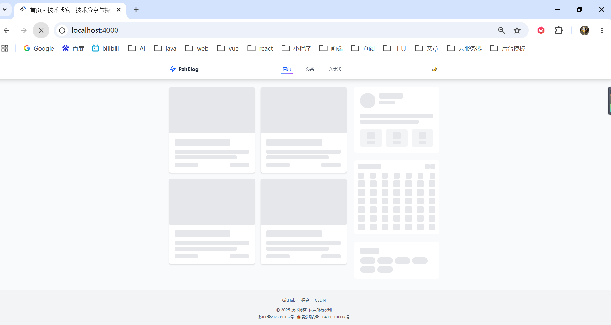
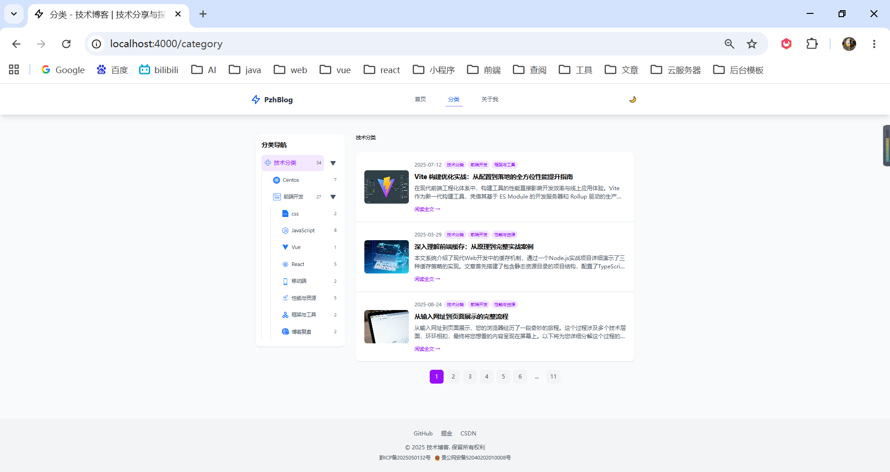
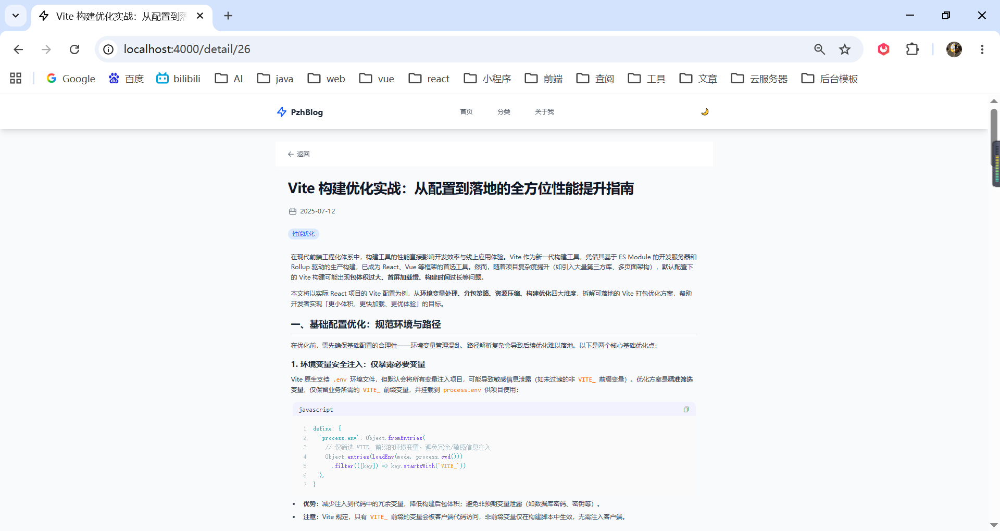
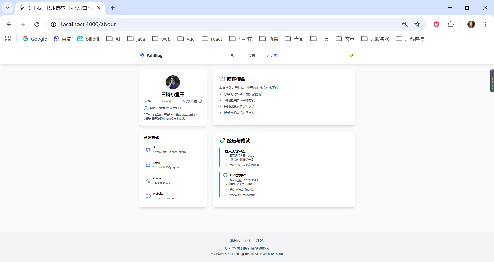
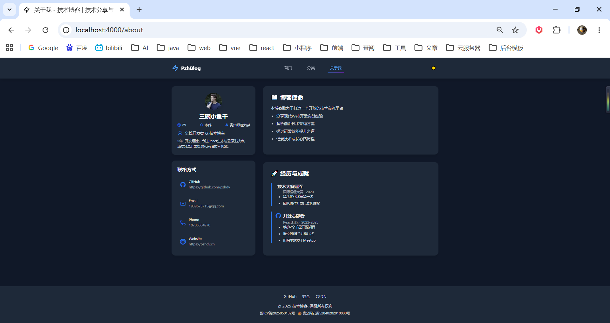

# 📚 个人技术博客前端

一个基于 React + TypeScript + Vite 构建的现代化个人技术博客系统，专注于前端开发、Web技术分享与探索。

> 在线预览 https://pzhdv.cn

### 项目仓库

- 前端：https://github.com/pzhdv/blog
- 前端 API：https://github.com/pzhdv/blog-api
- 后台管理：https://github.com/pzhdv/blog-admin
- 后台 API：https://github.com/pzhdv/blog-admin-api

## ✨ 特性

- 🚀 **现代化技术栈**: React 19 + TypeScript + Vite 7
- 🎨 **响应式设计**: 基于 Tailwind CSS 4.x，支持移动端和桌面端
- 📝 **Markdown 支持**: 完整的 Markdown 渲染，支持代码高亮
- 🌙 **主题切换**: 支持明暗主题切换
- 📱 **移动端优化**: 响应式布局，完美适配各种设备
- 🔍 **分类浏览**: 支持文章分类和标签系统
- 📅 **博客日历**: 可视化展示文章发布时间
- ♾️ **无限滚动**: 优化的文章列表加载体验
- 🎯 **SEO 友好**: 完善的 meta 标签和语义化结构
- 🔄 **骨架屏加载**: 优雅的加载占位体验
- 📦 **代码分割**: 智能的 chunk 分包策略，优化加载性能

## 📸 成果展示

### 🖥️ pc端

**骨架屏**(加载数据)

**首页**

**文章分类**

**文章详情**

**关于我**

**切换主题**


### 📱 移动端


## 🛠️ 技术栈

### 🔧 核心框架

| 技术         | 版本   | 说明                  |
| ------------ | ------ | --------------------- |
| React        | 19.1.0 | 用户界面库            |
| TypeScript   | 5.8.3  | 类型安全的 JavaScript |
| Vite         | 7.0.0  | 现代化构建工具        |
| React Router | 6.30.1 | 客户端路由            |

### 🎨 样式与UI

| 技术              | 版本   | 说明                   |
| ----------------- | ------ | ---------------------- |
| Tailwind CSS      | 4.1.11 | 原子化 CSS 框架        |
| @tailwindcss/vite | 4.1.11 | Tailwind CSS Vite 插件 |

### 📊 状态管理

| 技术          | 版本  | 说明             |
| ------------- | ----- | ---------------- |
| Zustand       | 5.0.6 | 轻量级状态管理库 |
| React Context | 内置  | 全局状态共享     |

### 💾 数据处理

| 技术                     | 版本   | 说明          |
| ------------------------ | ------ | ------------- |
| Axios                    | 1.10.0 | HTTP 客户端   |
| React Markdown           | 10.1.0 | Markdown 渲染 |
| React Syntax Highlighter | 15.6.1 | 代码语法高亮  |
| date-fns                 | 4.1.0  | 日期处理工具  |

### 🔧 开发工具

| 技术        | 版本   | 说明           |
| ----------- | ------ | -------------- |
| ESLint      | 9.29.0 | 代码质量检查   |
| Prettier    | 3.6.2  | 代码格式化     |
| Husky       | 9.1.7  | Git hooks 管理 |
| Commitizen  | 4.3.1  | 规范化提交信息 |
| lint-staged | 16.1.2 | 暂存文件检查   |

## 🏗️ 项目结构

```
blog/
├── public/                 # 静态资源
├── src/
│   ├── api/                # API 接口定义
│   ├── assets/             # 静态资源
│   ├── components/         # 可复用组件
│   │   ├── BlogCalendar/   # 博客日历组件
│   │   ├── GlobalErrorBoundary.tsx
│   │   ├── MarkdownRenderer.tsx
│   │   ├── Skeleton/       # 骨架屏组件
│   │   │   ├── HomeSkeleton.tsx
│   │   │   ├── BlogDetailSkeleton.tsx
│   │   │   ├── CategorySkeleton.tsx
│   │   │   ├── AboutSkeleton.tsx
│   │   │   └── SkeletonBase.tsx
│   │   ├── ThemeToggle.tsx
│   │   └── ...
│   ├── context/            # React Context
│   ├── hooks/              # 自定义 Hooks
│   ├── layout/             # 布局组件
│   │   ├── Header.tsx
│   │   ├── Footer.tsx
│   │   └── index.tsx
│   ├── pages/              # 页面组件
│   │   ├── Home.tsx        # 首页
│   │   ├── BlogDetail.tsx  # 文章详情
│   │   ├── Category.tsx    # 分类页面
│   │   └── About.tsx       # 关于页面
│   ├── routers/            # 路由配置
│   ├── store/              # Zustand 状态管理
│   │   └── home.ts         # 首页状态管理
│   ├── types/              # TypeScript 类型定义
│   ├── utils/              # 工具函数
│   └── App.tsx             # 应用入口
├── index.html              # HTML 模板
├── package.json            # 项目配置
├── tsconfig.json          # TypeScript 配置
├── vite.config.ts         # Vite 配置
└── .cz-config.cjs         # Commitizen 配置
```

## 🚀 快速开始

### 📋 环境要求

- Node.js >= 18
- npm >= 9 或 yarn >= 1.22

### 📥 安装依赖

```bash
npm install
# 或
yarn install
```

### 💻 开发环境

```bash
# 开发模式启动
npm run dev

# 生产模式启动（用于测试）
npm run prod
```

访问 http://localhost:4000 查看应用

### 🚢 构建部署

```bash
# 开发环境构建
npm run build:dev

# 生产环境构建
npm run build:prod

# 预览构建结果
npm run preview
```

## 🔧 开发工具

### 🧹 代码质量

```bash
# ESLint 检查
npm run lint

# 修复 ESLint 问题
npm run lint:fix

# 修复所有文件的 ESLint 问题
npm run lint:fixAll

# Prettier 格式化
npm run format
```

### 📝 提交规范

项目使用 Commitizen 进行规范化提交：

```bash
# 规范化提交
npm run commit
```

支持的提交类型：

- `feat`: 新功能
- `fix`: 修复问题
- `docs`: 文档更新
- `style`: 代码格式调整
- `refactor`: 代码重构
- `test`: 测试相关
- `chore`: 构建过程或辅助工具的变动

## 🌐 环境配置

### ⚙️ 环境变量

在项目根目录创建环境变量文件：

```bash
# .env - 所有环境共用
VITE_API_BASE_URL=https://your-api-domain.com/api

# .env.development - 开发环境
VITE_API_BASE_URL=http://localhost:8080/blogApi

# .env.production - 生产环境
VITE_API_BASE_URL=https://your-production-api.com/api
```

## 📦 构建优化

项目包含多项性能优化配置：

### ✂️ 代码分割

- 智能的依赖分包策略
- React 核心库单独打包
- 第三方库按功能分组
- 小依赖合并打包

### 📉 压缩优化

- 生产环境启用 Gzip 和 Brotli 压缩
- Terser 代码压缩和混淆
- 移除开发环境的 console 语句

### 📊 分析工具

- 构建产物可视化分析
- Bundle 大小监控
- 压缩效果统计

## 🎨 主题系统

支持明暗主题切换，主题状态通过 Context 全局管理：

- 自动检测系统主题偏好
- 手动切换主题模式
- 主题状态持久化存储

## 📜 许可证

本项目采用 MIT 许可证 - 查看 [LICENSE](LICENSE) 文件了解详情

## 👨‍💻 作者

- 🧩 **潘宗晖 (PanZonghui)**
- 🌐 **博客**: https://pzhdv.cn
- 📧 **邮箱**: 1939673715@qq.com
- 🐙 **GitHub**: https://github.com/pzhdv

## 🙏 致谢

感谢以下开源项目的支持：

- ⚡ [Vite](https://vitejs.dev/) — 下一代前端构建工具
- ⚛️ [React](https://react.dev/) — 用于构建用户界面的 JavaScript 库
- 📘 [TypeScript](https://www.typescriptlang.org/) — JavaScript 的超集
- 🎨 [Tailwind CSS](https://tailwindcss.com/) — 实用优先的 CSS 框架
- 🗃️ [Zustand](https://github.com/pmndrs/zustand) — 轻量级 React 状态管理
- 📝 [React Markdown](https://github.com/remarkjs/react-markdown) — React Markdown 渲染组件

---

如果这个项目对你有帮助，请给个 ⭐ Star 支持一下！
